# Analysis of Booking Holdings Inc. Stock Volatility and ARIMA Modeling with Python

**[Open the notebook →](./BKNG_ARIMA_Analysis.ipynb)**

---
## What this project does

Following the classical **Box–Jenkins methodology**:

1. **Exploratory analysis** — descriptive statistics, histograms, and Q-Q plots for both the
   raw closing-price series and log returns.
2. **Autocorrelation analysis** — ACF/PACF correlograms with Ljung-Box Q-tests, plus
   **Augmented Dickey-Fuller (ADF)** unit-root tests under three specifications (none,
   constant, constant+trend).
3. **Model identification & estimation** — an initial `ARMA(1,1)` on the differenced price
   series, tested down to the parsimonious `ARIMA(0,1,0)` (random walk) once the AR/MA terms
   proved statistically insignificant.
4. **Diagnostics** — residual autocorrelation (Ljung-Box, Breusch-Godfrey LM), ARCH-LM test
   for volatility clustering, Jarque-Bera normality test, and a **Chow breakpoint test** for
   structural stability.
5. **Forecasting** — a 15-trading-day-ahead forecast with 95% confidence intervals and
   standard forecast-accuracy statistics (RMSE, MAE, MAPE, Theil's U, Bias Proportion).

Every statistical test below — ADF, ARMA (via conditional least squares), Breusch–Godfrey,
ARCH-LM, Jarque–Bera, Chow — is **implemented from scratch** on top of `numpy` / `scipy` /
`pandas` in [`notebook/tsa_toolkit.py`](./notebook/tsa_toolkit.py). No `statsmodels`
dependency is required, so the notebook runs in any plain Python environment (including
sandboxes with no internet access to `pip install`).

---

## A note on the data

Two things changed between the original 2026-dated paper and this replication:

- **Stock split.** Booking Holdings completed a **25-for-1 forward stock split in April
  2026**. Current price data from Yahoo Finance is split-adjusted, so all prices in this
  project are **rescaled ×25** back to the pre-split nominal level (matching the paper's
  original $3,000–$5,800 range) for direct comparability.
- **Sample window.** The dataset covers for **Sep 20, 2024 – May 16, 2025** (164
  trading days) — All figures and statistics below are computed on this **real, unmodified**
  price data (not simulated).

---

## Results

### 1. Elementary statistical analysis

The raw closing-price series shows a clear, strongly trending, non-stationary pattern:

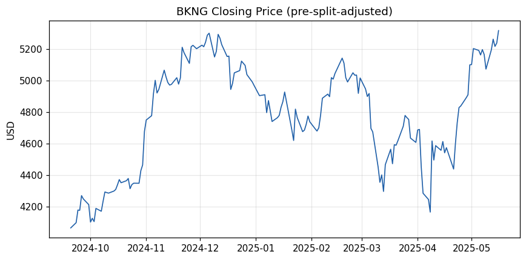

Descriptive statistics and the Jarque-Bera test both point to a non-normal, mildly
left-skewed distribution of price *levels* — expected, since a trending series is never
normally distributed in levels:

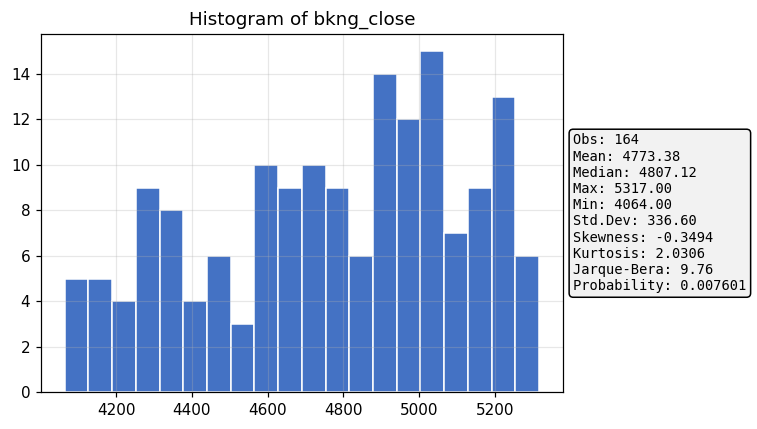
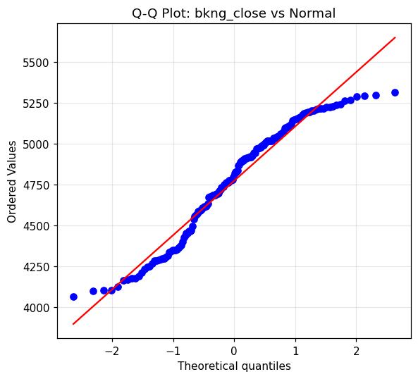

**Log returns**, in contrast, oscillate around a near-zero mean with no visible trend —
the classic signature of a stationary series:

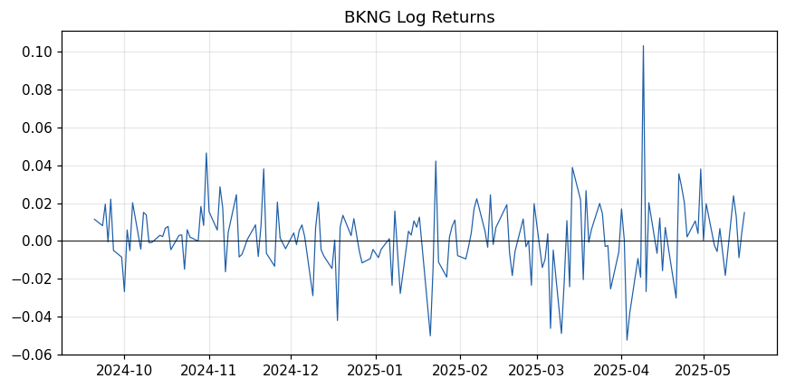
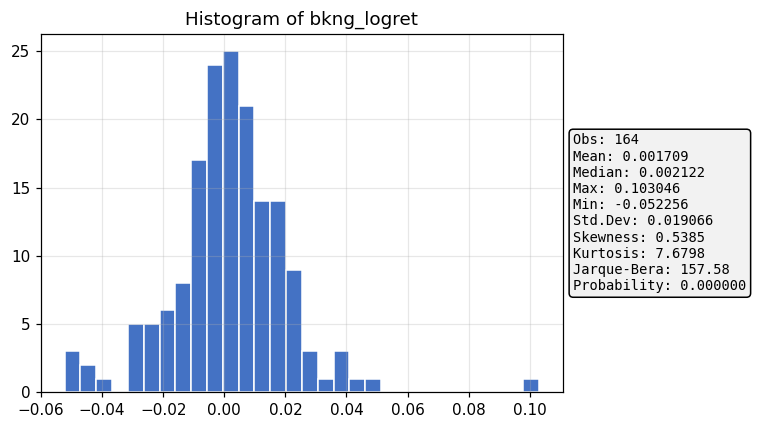
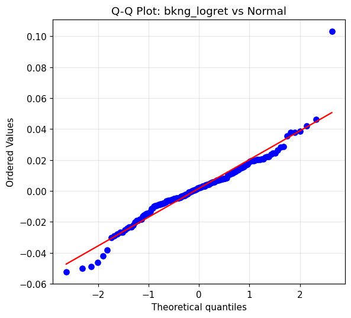

The Q-Q plot shows fat tails relative to the normal distribution — log returns are
**leptokurtic**, a well-known stylized fact of financial return series.

### 2. Autocorrelation analysis

The correlogram of the raw price level decays extremely slowly (AC ≈ 0.94 at lag 1,
barely declining through lag 20) — the textbook signature of a **unit root**:

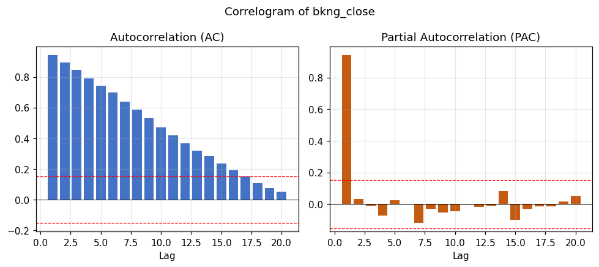

The correlogram of log returns falls almost entirely within the 95% confidence bands, and
the Ljung-Box Q-test fails to reject the null of no autocorrelation (p = 0.49 at lag 1) —
log returns are close to **white noise**:

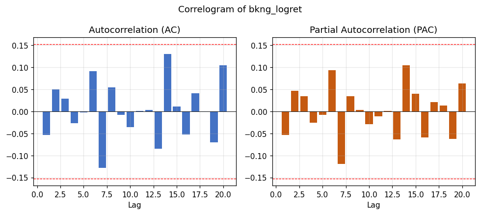

Squared log returns (a proxy for volatility) also show no significant autocorrelation over
20 lags — no obvious ARCH effects in this sample:

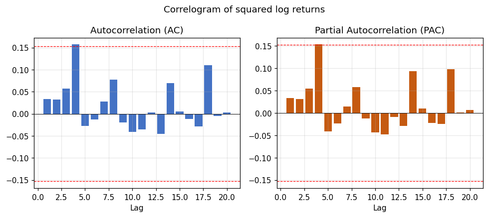

**ADF unit-root tests** confirm the visual read:

| Series | Spec | ADF t-stat | 5% crit. value | Verdict |
|---|---|---|---|---|
| `bkng_close` | none | 0.96 | −1.94 | fail to reject H0 → **unit root** |
| `bkng_close` | constant | −1.99 | −2.86 | fail to reject H0 → **unit root** |
| `bkng_close` | const+trend | −2.00 | −3.41 | fail to reject H0 → **unit root** |
| `bkng_logret` | none | −13.32 | −1.94 | reject H0 → **stationary** |
| `bkng_logret` | constant | −13.38 | −2.86 | reject H0 → **stationary** |
| `bkng_logret` | const+trend | −13.35 | −3.41 | reject H0 → **stationary** |

This matches the original paper's conclusion exactly: raw prices need one difference
(`d = 1`) before ARIMA modeling; log returns (equivalently, the differenced log-price) are
already stationary.

### 3. ARIMA modeling

**Identification.** An initial `ARMA(1,1)` on the differenced price series is
over-specified — both coefficients are statistically insignificant:

| Term | Coefficient | t-stat | p-value |
|---|---|---|---|
| AR(1) | −0.038 | −0.04 | 0.968 |
| MA(1) | −0.014 | −0.01 | 0.988 |

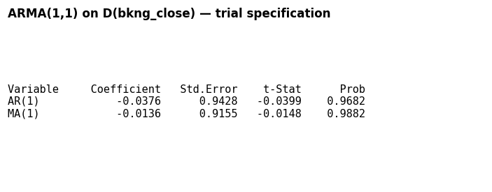

**Adopted model: `ARIMA(0,1,0)`** — a random walk. The drift term is also statistically
insignificant (p = 0.27), so the series is a **random walk without drift**:

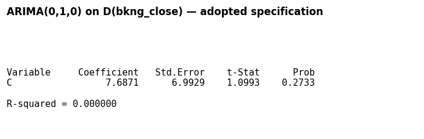

**Diagnostics.** The residual correlogram shows no significant autocorrelation
(Q-stat p = 0.51 at lag 1), confirmed by the Breusch-Godfrey LM test:

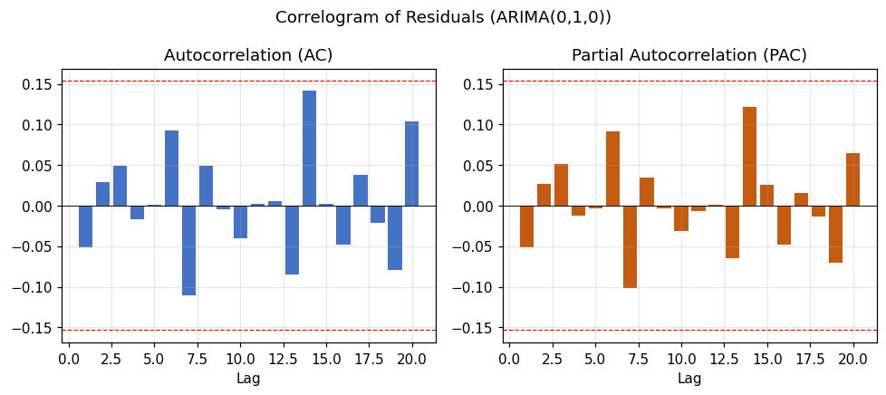
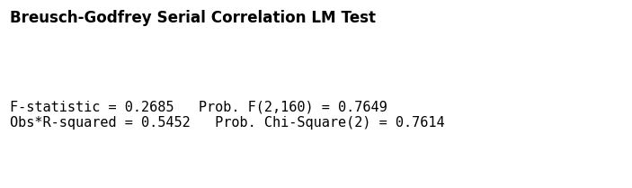

The **ARCH-LM test** finds no evidence of volatility clustering in the residuals
(p = 0.73) — a GARCH extension is not warranted for this sample:

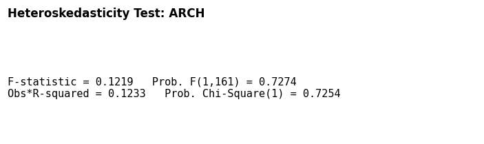
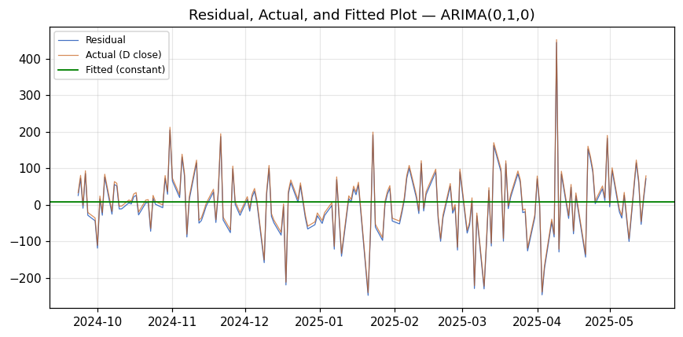

Residuals remain **leptokurtic and non-normal** (Jarque-Bera rejects normality,
p ≈ 0.000) — consistent with the "fat tails" stylized fact of financial data rather than
a modeling failure:

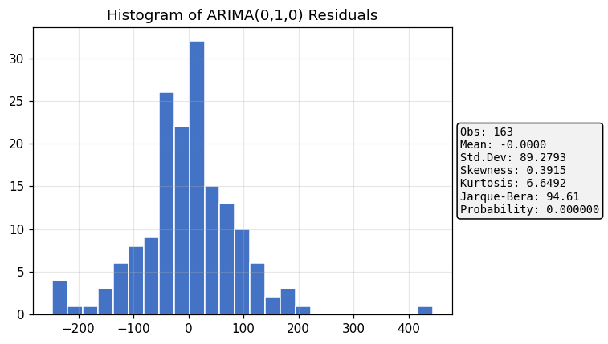

A **Chow breakpoint test** finds no evidence of a structural break — the random-walk
model is stable across the full sample:

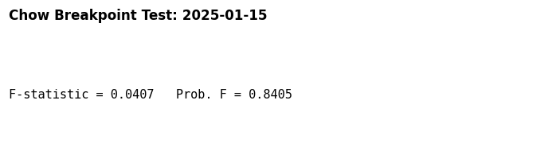

### 4. Forecasting

Because the adopted model is a driftless random walk, the optimal point forecast is the
**naive forecast** — all future values equal the last observed price, with confidence
intervals that widen with the square root of the horizon (shocks to a random walk are
permanent, so uncertainty accumulates rather than reverting to a mean):

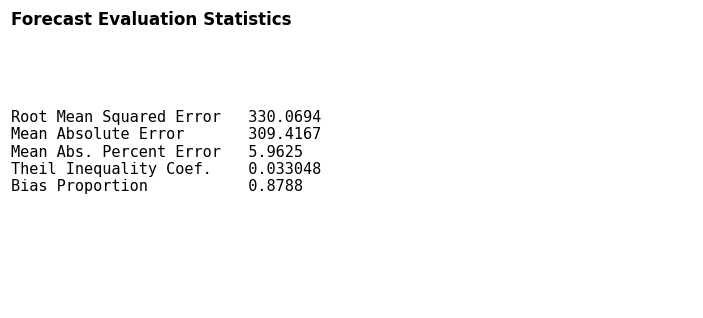
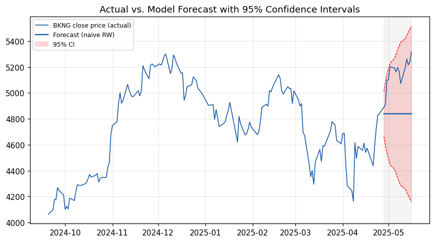

Theil's U close to zero indicates the forecast is well-calibrated in relative terms, while
the high **Bias Proportion** (~0.88) reflects that the naive forecast is a *level* forecast
that doesn't track the subsequent short-term rally within the 15-day window — an expected
limitation of any model built on the efficient-market/random-walk assumption.

---

## Conclusion

BKNG's closing price behaves as a classic **non-stationary random walk**: the ADF test
fails to reject a unit root at every specification, but first-differenced log returns are
stationary and statistically indistinguishable from white noise. The Box–Jenkins procedure
converges on the simplest possible model, `ARIMA(0,1,0)` without drift — past price
movements carry no linear predictive information about future returns. This is consistent
with the weak-form Efficient Market Hypothesis and matches the conclusion of the original
EViews-based paper almost exactly, despite the shorter sample window used here.

---

## Repository structure

```
.
├── README.md                          <- this file
├── BKNG_ARIMA_Analysis.ipynb          <- the full analysis notebook
├── analysis_log.txt                   <- plain-text log of every statistic printed
├── data/
│   ├── bkng_close_2024_2025_demo.csv  <- real BKNG close prices used in this run
│   └── bkng_split_adjusted_raw.csv    <- underlying OHLCV data as pulled from Yahoo Finance
├── figures/                           <- every PNG chart, generated by the notebook/scripts
└── notebook/
    ├── tsa_toolkit.py                 <- from-scratch ADF / ARMA / LM-test / Chow implementations
    ├── run_analysis.py                <- Part 1: data + descriptive statistics
    ├── run_analysis_part2.py          <- Part 2: correlograms + ADF tests
    ├── run_analysis_part3.py          <- Part 3: ARIMA identification, estimation, diagnostics
    ├── run_analysis_part4.py          <- Part 4: forecasting + conclusion
    └── build_notebook.py              <- assembles the four run_analysis_*.py scripts into the .ipynb
```
## Tools & techniques

`Python` · `pandas` · `NumPy` · `SciPy` (optimization, distributions) · `Matplotlib` ·
Box–Jenkins ARIMA methodology · ADF unit-root testing · Ljung-Box / Breusch-Godfrey /
ARCH-LM diagnostic testing · Jarque-Bera normality testing · Chow breakpoint testing ·
time-series forecasting & evaluation (RMSE, MAE, MAPE, Theil's U)
